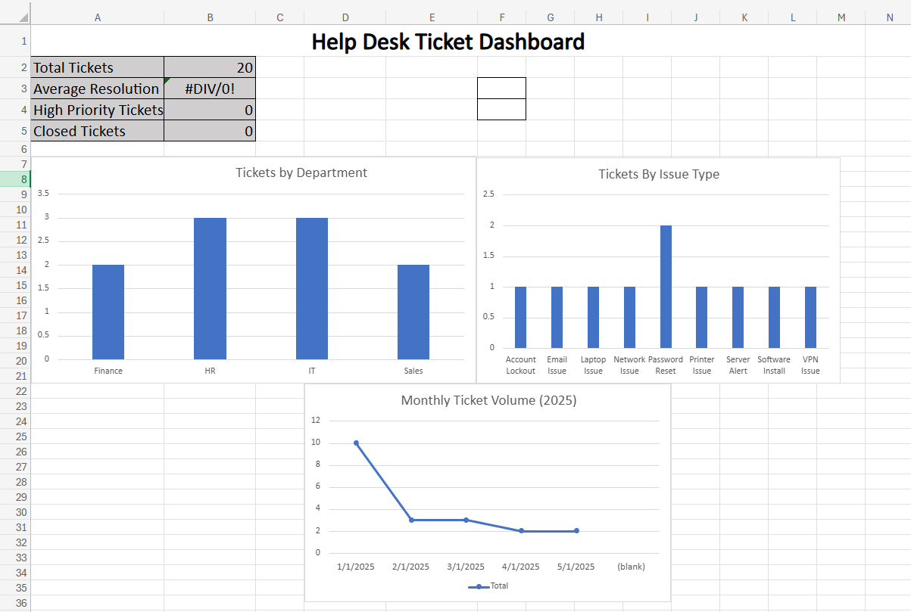

# Help Desk Ticket Dashboard (Excel)

## Project Overview
This project analyzes IT help desk ticket data using Excel pivot tables, KPI metrics, and dashboard visualizations to identify workload trends and common support issues.

## Key Questions Answered
- Which departments generate the most tickets?
- What are the most common issue types?
- How does ticket volume change month-to-month?
- What is the average resolution time?
- How many high-priority tickets occurred?

## Features
- Clean dataset with derived time fields (Month / MonthSort)
- Pivot tables for department and issue analysis
- KPI cards (Total Tickets, Avg Resolution Time, High Priority, Closed Tickets)
- Monthly ticket volume trend line chart
- Dashboard layout optimized for quick insights

## Tools Used
- Microsoft Excel (Excel Online)
- Pivot Tables & Pivot Charts
- KPI metrics & time-series trend analysis

## Dashboard Preview

## Files
- `helpdesk_ticket_dashboard.xlsx` — interactive dashboard workbook
- `Helpdesk_dashboard_preview.png` — dashboard screenshot preview
